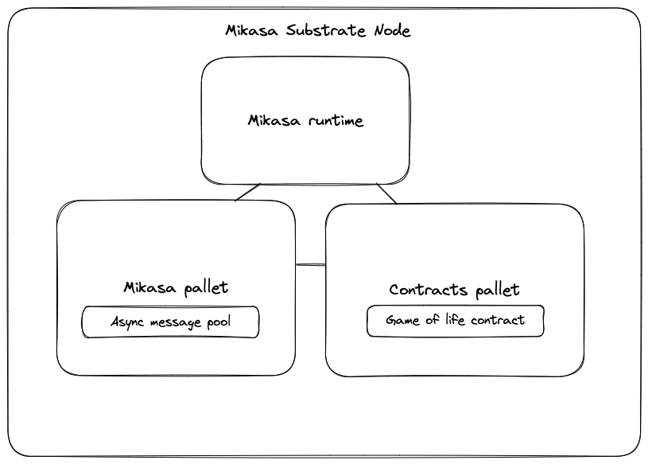

# Autonomous smart contracts enabled subtrate node

## Architecture

[

### Pre requisites

```sh
sudo apt-get update && apt-get upgrade
sudo apt install build-essential clang curl git make protobuf-compiler libprotobuf-dev
```
Install Rust

```sh
curl --proto '=https' --tlsv1.2 -sSf https://sh.rustup.rs | sh
rustup default stable
rustup update
rustup update nightly
rustup target add wasm32-unknown-unknown --toolchain nightly
```


### Build

Use the following command to build the node without launching it:

```sh
cargo build --release
```

### Run

```sh
cargo run --release -- --dev
```
