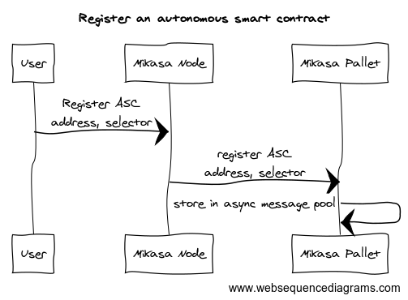
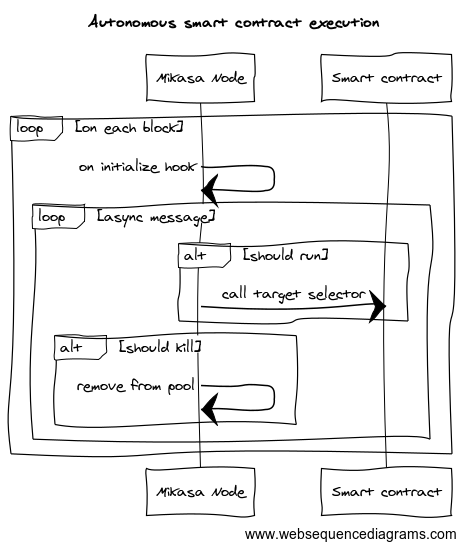

# Autonomous smart contracts enabled subtrate node

## Architecture


## Flow

### Register an autonomous smart contract

1. User creates a smart contract and deploys it to the blockchain.
2. User registers the smart contract with the node using `register_async_message` extrinsic.



### Autonomous smart contract execution

1. The node periodically checks the registered smart contracts and executes them. The execution of this check is done with `on_initialize` hook.
2. The node checks if the smart contract is ready to be executed. If it is, the node executes the smart contract and updates the state of the smart contract.
3. The node checks if the autonomous smart contract should be removed from the pool. If it should, the node removes the smart contract from the pool.


### Pre requisites

```sh
sudo apt-get update && apt-get upgrade
sudo apt install build-essential clang curl git make protobuf-compiler libprotobuf-dev
```
Install Rust

```sh
curl --proto '=https' --tlsv1.2 -sSf https://sh.rustup.rs | sh
rustup default stable
rustup update
rustup update nightly
rustup target add wasm32-unknown-unknown --toolchain nightly
```


### Build

Use the following command to build the node without launching it:

```sh
cargo build --release
```

### Run

```sh
cargo run --release -- --dev
```
